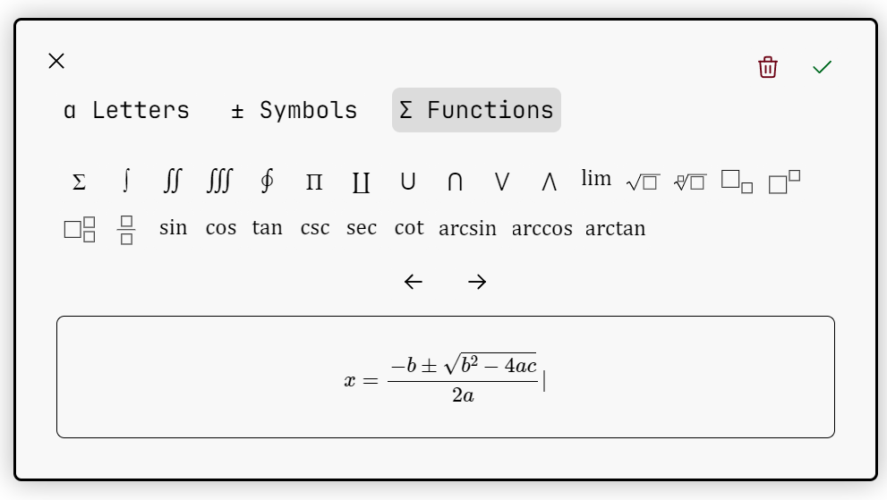

# mjxgui
An embeddable WYSIWYG equation editor for the web with LaTeX support

MJXGUI is a widget style application meant to give users a graphical interface for creating equations 
to use on the web. It uses MathJax as a core dependency and as an external renderer to show users a preview 
of their equation/expression as they are building it.  

It then generates LaTeX for the entered equation for you to handle however you want.

Documentation is at [hrus.in/mjxgui](https://hrus.in/mjxgui)



# Features
- Build mathematical, physical, and chemical equations using a GUI, similar to inserting equations in 
editors like Microsoft Word or Google Docs.
- Support for common symbols, Greek letters, common math functions and operators.
- Write your own functions, operators, and characters to add support for the same not available out of the box.
- Convert created equations into LaTeX.

# Contributing
Please read [CONTRIBUTING.md](docs/contributing.md) to get started.

# Installation
MJXGUI uses MathJax as a core dependency, so you need to include both MathJax and 
MJXGUI into your webpage. MJXGUI does not have a built-in renderer, and uses MathJax to render the
equations as they are being built.

Make sure you include MathJax  before including MJXGUI.
Then include the minified MJXGUI source file in your <head> tag by getting the [source from GitHub](https://raw.githubusercontent.com/hrushikeshrv/mjxgui/main/src/mjxgui.min.js).  

A sample configuration is shown below  

````html
<script src="https://polyfill.io/v3/polyfill.min.js?features=es6"></script>
<script id="MathJax-script" async src="https://cdn.jsdelivr.net/npm/mathjax@3/es5/tex-mml-chtml.js"></script>
<link rel="stylesheet" href="path/to/mjxgui/css">
<script src="path/to/mjxgui/javascript"></script>
````

# Usage
MJXGUI works by showing your users a button/element prompting them to insert an equation. 
MJXGUI attaches event listeners to these elements and shows the editor UI when they are clicked.

Once the user is done entering the equation/expression, the editor UI disappears, and a 
callback function that you supply is run. This callback function has access to the full internal 
API, from which you can access the generated LaTeX for the expression the user just entered. 
Make sure the callback function you supply is not an arrow function but a regular function.

Initialize MJXGUI by creating a new MJXGUI instance, which takes 3 parameters - a CSS selector, a callback function, and some optional configuration options.

	const gui = new MJXGUI(‘selector’, function() {}, options={})

The selector is a CSS selector that should be able to select the elements you want users to click 
on to start entering an equation. MJXGUI adds click event listeners to all selected elements and 
shows the editor UI whenever they are clicked.

The callback function is a function that is run when the user is done entering the equation and 
clicks on the “Done” button. This is where you will be able to access the LaTeX for the equation. 
The `this` keyword inside this function will have access to the MJXGUI cursor, which contains all 
the methods and properties used to build equations and generate LaTeX for them. Calling 
`this.cursor.toLatex()` will generate the LaTeX for the equation and return it to you as a string.

You would build a minimal example as shown below. This example takes the LaTeX for the equation 
the user has created, appends it to the body, and typesets it using MathJax.

````javascript
    // The element to listen for keypresses
    <button id="add-equation-button">Add Equation</button>

    // We add the entered equation to this div
    <div id="equation-output"></div>

    <script>
        const eqnOutput = document.querySelector('#equation-output');
        
        // Create new MJXGUI instance
        const gui = new MJXGUI('#add-equation-button', function() {
            MathJax.typesetClear([eqnOutput]);
            eqnOutput.innerHTML += '$$' + this.cursor.toLatex() + '$$' + '<br>';
            MathJax.typesetPromise([eqnOutput]).then(() => {});
        })
    </script>
````

For a details reference please check the [docs](https://hrus.in/mjxgui)

