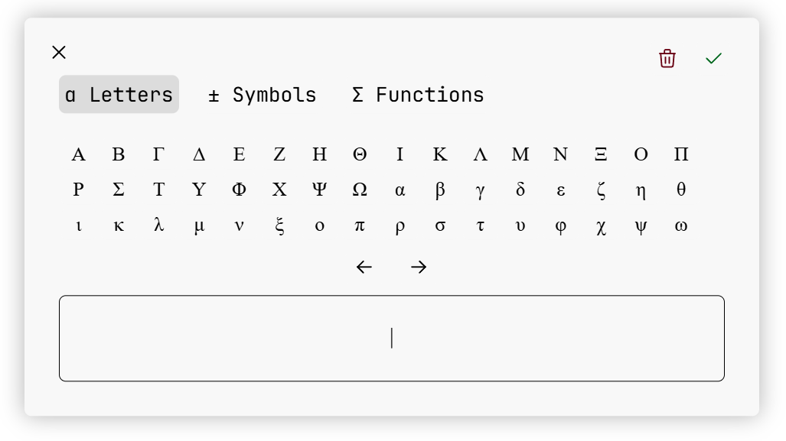

# What is MJXGUI?
MJXGUI is a widget style application meant to give users a graphical interface for creating equations to use on the web. It uses MathJax as a core dependency and as an external renderer to show users a preview of their equation as they write it. Once users have created their equation, it generates corresponding LaTeX for it for you to handle however you would like, the most common use case being to store it as plain text, so you can use it later with MathJax.

The motivation is to have something like a pop-up widget that would help users build an expression graphically just as they do in Google Docs or Microsoft Word, but then would also convert the same equation into LaTeX so it could be rendered with MathJax later.

This is what the editor widget looks like -

# Features
- Build mathematical, physical, and chemical equations using a GUI, similar to inserting equations in editors like Microsoft Word and Google Docs
- Support for Greek letters, mathematical operators, and common mathematical functions
- Write your own math functions, operators, and characters to add support for the same not available by default.
- Convert created equations into LaTeX for storage and representation in the browser.
